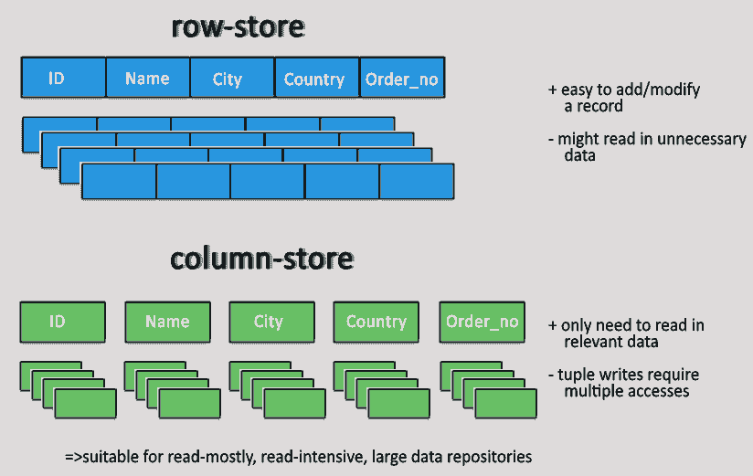
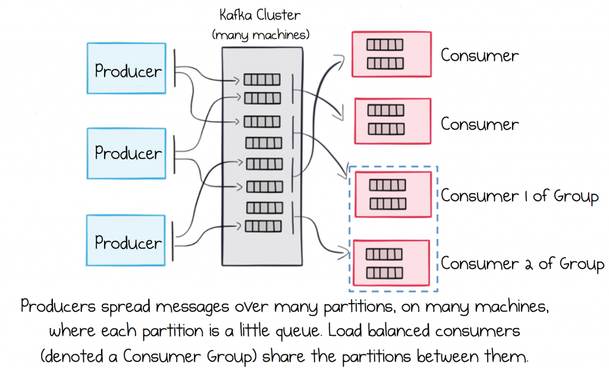

## Part 1: Foundations of Data Systems

* * *

### Ch 1: Reliable, Scalable, and Maintainable Applications

#### A. Reliability
A system is reliable only if it **Fault Tolerant**.

Fault ≠ Failure. **Fault** is when a system component deviates from its spec. 
Whereas **Failure** is when system as a whole stops providing required service.

System designer's goal is to prevent faults from turning into failure.

Fault can happen in many ways:
  * Hardware fault: hardisk crash, network failure
    * Alleviated by adding redundancy to the hardware component
  * Human error: design error, config error
    * Alleviated by following best practice, thorough automated testing, CI/CD, etch

#### B. Scalability
A system is scalable if it can handle increased load. 

System load is described by **load parameters**, which depends on the purpose of a system. 
For example, requests per second, simultaneous active connections, hits for cache, etc.

**Performance** can be viewed in two ways:
* increase load parameter and keep the system resource, see how the system is affected
* increase load parameter, see ow much resource is need to keep system performance unchanged

Percentile is usually used to measure request response time. **Service level object (SLO)** and **service level argreement (SLA)** are used to define expected performance. Percentile is usually to define such goals, like 99& of uses should have X response time.

Two ways to cope with load:
* Vertical scaling (more powerful machine)
* Horizontal scaling (more nodes)

#### C. Maintainability

* Operability: make it easy for ops/infra teams
  * Ex: Monitor system health.
* Simplicity: make it easy for new engineers
* Evolvability: make it easy to make changes.

* * *

### Ch 2: Data Models and Query Languages

#### A. Relational Model vs. Document Model

##### Consideration
* Restrictive schema or no schema(actually: schema-on-read) ?

##### Relational Model
* Pro
* Cons
  * There's **object-relational mismatch**, that is when application language is OOP but datastore is relational. 
    So, you need to have a "translation layer". This problem is partially solved by ORM library like [gorm.io](http://gorm.io) or [hibernate](https://hibernate.org/orm/).
* Use when:
  * Many-to-Many relationships are needed.
* Example
  * VM: MySQL
  * DBaaS
    * GCP: Cloud SQL, Cloud Spanner 
    * AWS: RDS, Aurora, Redshift 

##### Document Model
* Pro
* Cons
* Use when:
  * The data has document-like structure(a tree), where tipycally the entire tree is loaded at once.
* Example
  * VM: MongoDB 
  * DBaaS
    * GCP: Firestore 
    * AWS: DocumentDB, DynamoDB 

#### B. Query Languages for Data
* Declarative: SQL
* MapReduce Querying

#### C. Graph-Like Model
* Property Graphs
* The Cypher Query Language
* Graph Queries in SQL
* Triple-Stores and SPARQL
* The Foundation: Datalog
* Example
  * VM: Neo4J 
  * DBaaS
    * GCP
    * AWS: Neptune 

#### (Why there's no) Key-Value Model
* Why there's no? Maybe too simple
* Example
  * VM: Redis, Memcached 
  * DBaaS
    * GCP: Memorystore 
    * AWS: ElastiCache for Redis, ElastiCache for Memcached 
fs
#### (Why there's no) Timeseries
* Why there's no? 
* Example
  * VM: InfluxDB, Prometheus, TimescaleDB, Graphite 
  * DBaaS
    * GCP: 
    * AWS: Timestream 

#### (Why there's no) Wide-Column
* Why there's no? Later
* Example
  * VM: Cassandra 
  * DBaaS
    * GCP: Bigtable 
    * AWS: Keyspace for Cassandra 

#### (Why there's no) Ledger
* Why there's no? Read on blockchain specific book
* Example
  * VM: 
  * DBaaS
    * GCP:
    * AWS: QLDB 
    * All cryptocurrency is backed by ledger

* * *

### Ch 3: Storage and Retrieval

#### A. Data Structures That Power Your Database

Many databases internally use a **log**, which is an append-only data file. 
In order to efficiently find the value for a particular key in the database, we need a different data structure: an **index**.
Indexes speed up read queries, but slows down writes.

##### Hash Indexes
* What is it? A `unordered_map[key]value` where key is mapped to a byte offset in the datafile
* Pro
  * simple, easy to implement
* Cons
  * has memory constraint that the hash table must fit in memory
  * range queries are not efficient since hashed key are not put next to each other
* Used by: Riak, [Bitcask](https://arpitbhayani.me/blogs/bitcask)

##### Sorted String Table(SSTable) & Log-Structured Merge Tree(LSM-Trees)
* What is it? 
  * A `ordered_map[key]value` backed with Red-Black trees or AVL trees (memtable)
  * If database crashes, memtable can be recovered by LSM-Trees's log
* Used by: LevelDB, RockDB

##### B-Trees
* What is it? 
  * A `ordered_map[key]value` like SSTable
* Used by: almost all relational DB

#### B. OLTP vs. OLAP

##### Data Warehousing

Data warehouse is a database that data people can query without affecting OLTP.
Data Engineer **etracted** data from OLTP, **transformed** it to certain structure optimized for analytics query, and then **load** it to the OLAP.

##### Stars and Snowflakes: Schemas for OLAP

TODO

##### Column-Oriented Storage

In OLTP databases, storage is laid out in a row-oriented fashion.
Whereas, in column-oriented storage, all the values from each column is stored together instead.

Data warehouse queries often involve an aggregate function (SUM, AVG...), on subset of column.
It might have sense to cache the results of such functions.  One way of creating such a cache is a **materialized view**.

A common special case of a materialized view is known as a **data cube** or OLAP cube which is a grid of aggregates grouped by different dimensions.

* * *

### Ch 4: Encoding and Evolution

#### A. Formats for Encoding Data

##### Language-Specific Formats
* Example: python's pickle, golang's gob, java serialization
* Cons: don't support multilanguage apps, not CPU efficient

##### Text Variant
* Pro: human-readable
* Cons: size inefficient, don't differentiate integer & float
* Example: JSON, XML

##### Binary Variant
* Thrift
* Protobuf
* Avro
* Reference
  * [Martin Kleppmann's: Schema Evolution in Avro, Protobuf, & Thrift](https://martin.kleppmann.com/2012/12/05/schema-evolution-in-avro-protocol-buffers-thrift.html)

####  B. Modes of Dataflow

##### Dataflow Through Databases
* Data structure in-memory encoded to written bytes stored in persistent storage
* Need to maintain forward compatibility to avoid data loss

##### Dataflow Through Services: REST and RPC
* REST
* RPC
  * Tries to make network request look the same as calling local function
  * RPC is fundamentally flawed 
    * local function call is predictable, but network request is unpredictable
    * Hard to pass complex objects via network request, because you have to encode everything into bytes first
* SOAP

##### Message-Passing Dataflow
* Message Broker
  * Ex: Kafka, RabbitMQ
  

* * *

## Part 2: Distributed Data

* * *

### Ch 5: Replication

Replication means keeping a copy of our data in many machines that are connected with each other using a network.
The goal is to increase system availibity, and also reducing latency by keeping data geographically close to users(ex: CDN).

#### A. Leaders and Followers
* Workflow
  1. Initial condition: **leader_node**(age = 30), **follower_nodes** = { node1(age = 20), node2(age = 20), node3(age = 20)}
  2. **Client** writes(age = 15) to **leader_node**
  3. **leader_node** changed its age to 15
  4. **leader_node** notify the change to its follower by sending a **replication log**
  5. **follower_nodes**.apply(**replication log**)
  6. Final condition: **leader_node**(age = 15), **follower_nodes** = { node1(age = 15), node2(age = 15), node3(age = 15)}
    [Ref.](https://www.brainstobytes.com/db-replication-i-introduction-to-database-replication/)
* Synchronous Versus Asynchronous Replication
  * Sync
    * only writes **after** all follower has the copy
    * Pros: system in consistent state
    * Cons: 99% impractical, if one follower nodes is down(**fault**), the leader must block the write operations until the nodes up again, means **system failure**
  * Async
    * Pro : fault tolerant
    * Cons: if one node down, system in inconsistent state
* Setting Up New Followers
  * [Ref.](https://www.brainstobytes.com/db-replication-i-introduction-to-database-replicationdb-replication-ii-failure-recovery-fundamentals/)
* Handling Node Outages
  * [Ref.](https://www.brainstobytes.com/db-replication-i-introduction-to-database-replicationdb-replication-ii-failure-recovery-fundamentals/)
* Implementation of Replication Logs
  * Statement-based replication
    * Workflow:
      1. client writes `query_stmt = INSERT INTO transactions VALUES(V...)` to leaders
      2. leader write to its log the `query_stmt` and send the log to its follower
    * Need to handling nondeterministic function such as `NOW()` to get current timestamp
  * Write-ahead log
  * Logical log replication
  * Triger-based replication

#### B. Problems with Replication Lag
* Reading Your Own Writes
* Monotonic Reads
* Consistent Prefix Reads
* Solutions for Replication Lag

#### C. Multi-Leader Replication
* Use Cases for Multi-Leader Replication
  * Multi-datacenter operation: each datacenter has its own leader. 
  * Client with offline operation: every client has a local database that acts as a leader
  * Real-time collaborative editing: 
    * when one user edits a document, 
    * then the changes are instantly applied to their local replica 
    * then asynchronously replicated to the server and any other users who are editing the same document.
* Handling Write Conflicts
* Multi-Leader Replication Topologies

#### D. Leaderless Replication
* Writing to the Database When a Node Is Down
* Limitations of Quorum Consistency
* Sloppy Quorums and Hinted Handoff
* Detecting Concurrent Writes

* * *

### Ch 6: Partitioning/Sharding

#### A. Partitioning and Replication
HDFS is an example of system that does both partition and replication.
Workflow:
1. Initial condition: data = {a, b, c, d}, let say HDFS has 4 nodes = { {}, {}, {}, {} }
2. Set replica level = 2, and partition data accross the whole HDFS cluster node
3. Final condition: nodes = { {a, b}, {c, d}, {a, c}, {b, d} }

#### B. Partitioning of Key-Value Data
* Partitioning by Key Range
* Partitioning by Hash of Key
* Skewed Workloads and Relieving Hot Spots

#### C. Partitioning and Secondary Indexes
* Partitioning Secondary Indexes by Document
* Partitioning Secondary Indexes by Term

#### D. Rebalancing Partitions
* Strategies for Rebalancing
* Operations: Automatic or Manual Rebalancing

#### E. Request Routing
* Parallel Query Execution  

* * *

### Ch 7: Transactions

#### A. The Slippery Concept of a Transaction
* The Meaning of ACID
  * Atomicity   : execute all operation or none
  * Consistency : transaction should not make database to turn into inconsistent state
  * Isolation   : concurrent operation all isolated
  * Durability  : once transaction is commited, it will remain commited even if there's system failure
* Single-Object and Multi-Object Operations

#### B. Weak Isolation Levels
Databases have tried to hide concurrency problems from application developers by providing transaction isolation. 
In practice, it is not that simple. The perfect isolation is **Serializable isolation**, but that comes with the price of worst performance.
For that reason database systems implement weaker levels of isolation.

One practices that ensure the ACID properties is **Read Commited**.
That is no dirty reads that means read data only after the data has been committed.
And, no dirty writes that means write/overwrite data only after the data has been committed.
* Snapshot Isolation by Multiversion Concurrency Control(MVCC)

The **lost update problem** can happen if two transactions write data concurrently, 
one of the updates might be lost because the second update does not have the first modification.
To prevent the **lost update problem**:

* **Atomic write** operations avoid the necessity of reading first from the database to modify a value.
* The application can **lock** the objects that are going to be modified rejecting the second update.

* Preventing lost update
  * Lost update can happen if two transcctions write to the same data concurrently, 

* Preventing Write Skew and Phantoms

#### C. Serializability

Serializable isolation is the strongest isolation level. 
It guarantees even transactions run in parallel, the result will be as if they had executed one at a time. 
These are serializability isolation technique:
* Actual (only run) Serial Execution
  * Cons: don't scale
* Two-Phase Locking (2PL)
  * Cons: don't perform well
* Serializable Snapshot Isolation (SSI)
  * 

* * *

### Ch 8: The Trouble with Distributed Systems

#### A. Unreliable Networks
* Network Faults in Practice, ex:
  * The request has been lost. 
  * The request may have been queued and will be delivered later.
  * The remote node may have temporarily stopped responding.
* Detecting Faults
* Timeouts and Unbounded Delays
* Synchronous Versus Asynchronous Networks

#### B. Unreliable Clocks
Each machine/component on distributed system has it own time. And, communicating through network take times.
Then, for some like `NOW()` in SQL query between 2 machine, how could we ensure that the time stored in database is exactly same in those 2 machine?

* Monotonic Versus Time-of-Day Clocks
* Clock Synchronization and Accuracy
* Relying on Synchronized Clocks
* Process Pauses

#### C. Knowledge, Truth, and Lies
* The Truth (on Distributed System) Is Defined by the Majority
* But, there is a risk that nodes may lie, it’s known as **Byzantine fault**.

* * *

### Ch 9: Consistency and Consensus

#### A. Consistency Guarantees
All durable data systems provide **eventual consistency**, but their implementations of the **"eventually"** part differ.
Consistency is a difficult topic, and it's one wrapped up in all of the other concerns of distributed systems.

[Ref.](http://liujunming.top/2018/10/07/Designing-Data-Intensive-Applications-%E8%AF%BB%E4%B9%A6%E7%AC%94%E8%AE%B0-Consistency-and-Consensus/)
[Ref.](https://github.com/ResidentMario/designing-data-intensive-applications-notes/blob/master/Chapter%209%20---%20Consistency%20and%20Consensus.ipynb)

#### B. Linearizability
* What Makes a System Linearizable?
  * all operations are atomic
  * no stale operations
* Relying on Linearizability
* Implementing Linearizable Systems
* The Cost of Linearizability

#### C. Ordering Guarantees
* Ordering and Causality
* Sequence Number Ordering
* Total Order Broadcast

#### D. Distributed Transactions and Consensus
* Atomic Commit and Two-Phase Commit (2PC)
  * Background
    * There are several situations in which it is important for nodes to reach **consensus** such as leader election and atomic commit in database.
    * 2PC is the most common way for achieving atomic transaction commit across multiple nodes.
  * What it is?
    * 2PC ≠ Two-Phase Locking
    * 2PC relies on a **coordinator**, usually a separate process, which performs a pre-flight check on all of the nodes involving, asking if they can perform the op. 
    * The nodes check and reply yes or no. If any nodes say no, the state change is aborted. If all nodes say yes, the coordinator sends a green light.
  * Why 2PC is bad for consensus algorithm?
    * if the **coordinator** goes down after all nodes ack but before it can send a green or red light, 
    * it's non-obvious how to recover (restarting the coordinator, sure, but that takes time).
* Distributed Transactions in Practice
  * Pros: provide safety guarantee
  * Cons: slow performance
* Fault-Tolerant Consensus
  * Example of algorithm: Paxos, Raft, Zab, VSR
  * How these algorithm solve 2PC weaknesses?
    * The consensus algorithms are all designed around epochs and strict quoroms.
    * Each time a leader loss occurs, a quorom of nodes is gathered to vote on a new leader. The new leader increments the epoch number.
    * Every time a leader wants to perform an action, it checks whether or not another leader with a higher epoch number exists.
    * To do this, it asks a quorom of nodes what the highest epoch number they have seen is. 
      * The insight: within a strict quorom, at least one of the nodes, at a minimum, was present in the most recent vote!
  * But, it still has its own weakness:
    * Consensus algorithms implement synchronous replication. Totally ordered atomic broadcast, we thus learn, requires we be synchronous.
    * Therefore it is very slow, particularly if the network is bad.
    * Additionally, certain network partitions can lead to very bad worst-case behavior, such as continuous elections.
    * Designing consensus algorithms that are more robust to network failures is an ongoing area of research.
  * Example of solution implementing that algorithm: ZooKeeper, etcd
* Membership and Coordination Services

* * *

## Part 3: Derived Data

* * *

### Ch 10: Batch Processing

[Ref](https://itiskj.hatenablog.com/entry/2018/10/31/105237)
#### A. Batch Processing with Unix Tools
* Simple Log Analysis
* The Unix Philosophy

#### B. MapReduce and Distributed Filesystems
* What is MapReduce
  * MapReduce is a bit like Unix tools, but distributed across potentially thousands of machines.
  * While Unix tools use stdin and stdout as input and output, MapReduce jobs read and write files on a distributed filesystem like Google’s GFS.
* Reduce-Side Joins and Grouping
* Map-Side Joins
* The Output of Batch Workflows
* Comparing Hadoop to Distributed Databases

#### C. Beyond MapReduce
* Materialization of Intermediate State
* Graphs and Iterative Processing
* High-Level APIs and Languages

* * *

### Ch 11: Stream Processing

#### A. Transmitting Event Streams
* Messaging Systems
* Partitioned Logs

#### B. Databases and Streams
* Keeping Systems in Sync
* Change Data Capture
* Event Sourcing
* State, Streams, and Immutability

#### C. Processing Streams
* Uses of Stream Processing
* Reasoning About Time
* Stream Joins
* Fault Tolerance

* * *